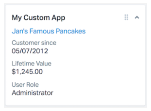

# HelpScout Custom Dynamic Application Using Shopify API

# What is a HelpScout Custom App?



Custom Apps enable you to pull data from a 3rd party source into the customer sidebar. Ideally, it would display information that adds context about the customer and your relationship; such as account level/plan, order history, how long they have been a customer or anything else that’s important to your business.
</br>
<h1 style="float: right;">Overview of HelpScout - Shopify Integration</h1> 
<p >This Helpscout- Shopify integration works in the following manner: when you receive an email in your HelpScout inbox and proceed to open email, this dynamic application pulls the email address of the sender. 

Then, this application utilizes the email address to compare data in your Shopify account and checks if a customer with aforementioned email address exists. The data returned from Shopify is displayed in the customer sidebar within HelpScout. This application is designed to assist customer service representatives when providing priority support to subscribed clients. 

The app decreases time to response, while increasing customer satisfaction and making work more seamless for the customer support team.</p>

# Tools 

<p>This application is built with the following tools:</p>

* NodeJS and Express
* Axios for xhr requests
* HelpScout Mailbox 2.0 Node.js SDK

# Installation

Install the following npm packages:

```
npm install express
npm install body-parser
npm install crypto
npm install axios
npm install helpscout-2.0
npm install dotenv
```
Require them into your app.js file, as follows:
```
const express = require("express");
const bodyParser = require("body-parser");
const crypto = require("crypto");
const axios = require("axios");
const HelpScout = require("helpscout-2.0");
require("dotenv").config();
```
Keep in mind that HelpScout Dynamic Apps require two things in order to function properly:

1. An HTTPS end-point URL on your server for Help Scout to call
2. A secret key (randomly generated by your 40-character or less string), used to generate message signatures
    - Place secret key inside .env file you generated earlier. Add .env file to gitignore.

# Getting a Response

When the message is received at your callback url, you can calculate a signature and compare it to the signature that Help Scout sends. If the signatures match, you know it’s from Help Scout.

You will need to utilize crypto npm package to create this signature and secure the app with the following parameters:

```
sha1
base64
```

When you open an email, the conversation is loaded and your custom App renders. Help Scout will build a JSON message with conversation data and call your endpoint URL with a POST request. 

We will get the customer email from this data, and store it in a variable `var helpScoutEmail`.

# Comparing Data with Shopify Database
To get access to Shopify Database, you will first need to create a Shopify Application in your Partner Dashboard. You can use [this guide](https://shopify.dev/tutorials/manage-apps-with-partner-dashboard) to set up your first application in Shopify.

Once your Shopify application is set up, use axios get request to get data about the customer by appending email variable as a URL parameter.

Keep in mind that Shopify axios GET request is nested inside the POST request for HelpScout API.   This request will return a Promise, which should be handled to display HTML inside the customer sidebar.

# Displaying Data in Customer Sidebar

We handle a Promise returned from Shopify API with a `.then()` statement and return HTML to display in the sidebar like this:
```
return res.json({
          html: `<div>Information you would like to display</div>`,
```

If you would like to also update tags within HelpScout based on the data you received, you could use Mailbox 2.0 Node.js SDK to simplify the PUT request:

```
conversation.then(data => {
          HelpScoutClient.rawApi(
            "PUT",
            `https://api.helpscout.net/v2/conversations/${helpScoutConversationId}/tags`,
            {
              tags: ["Support-Plus"],
            }
          );
        });
```
Within the axios request, remember to catch any errors:

```
.catch(error => {
      console.log(error);
    });
```
Lastly, start the express app:
```
app.listen(process.env.PORT || 5000, () => console.log("App is Listening"));
```
